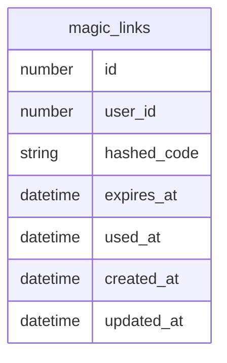

# Feature - Magic Links

Magic links are a feature that allow you to log into your account by sending
a link or a secret to your email address.

You then open a link, and type in the code that is in the email into 
the form, and it then creates a session for you.

The idea is that it is more convenient than having to remember a password, 
and also because the code changes on each login attempt, more secure than 
a password that stays the same.

I imagine that the flow goes like this:

1. A user lands on a page, and wishes to log in.
2. They see a form that asks for their email address, and a button to send them a magic link.
3. They fill in their email address and click the button.
4. A one-time code is generated and stored in a database table that is linked to their email address, with an expiry time.
5. An email is sent to the email address with the link to login, as well as the code to type in.
6. The user receives this email, clicks on the link, and then fills in the code into the form.
7. They submit the form, the Magic link code is authenticated.
    - If the code is correct and the magic link has not time-expired, then a new session is created for the user
    - If the code is incorrect, then the request is rejected and the user is informed
    - If the code is correct but the magic link has time-expired, then the request is rejected and the user is informed

## Database schema



## Sample code for the table generated by OpenAI:

```typescript
import { Knex } from "knex";

export async function up(knex: Knex): Promise<void> {
  await knex.schema.createTable("magic_links", (table) => {
    table.increments("id").primary();
    table.integer("user_id").notNullable(); // you can add a .references() if users table exists
    table.string("token").notNullable();
    table.string("hashed_code").notNullable();
    table.dateTime("expires_at").notNullable();
    table.dateTime("used_at").nullable();
    table.dateTime("created_at").notNullable().defaultTo(knex.fn.now());
    table.dateTime("updated_at").notNullable().defaultTo(knex.fn.now());
  });
}

export async function down(knex: Knex): Promise<void> {
  await knex.schema.dropTableIfExists("magic_links");
}
```

This is helping to clarify the idea further

## Things that we need:

1 - We need an endpoint to create a magic link code for a given user

e.g. POST /magic_links

## Tasks for doing the Magic Link Code feature

### Stage 1 - creating a magic link

- [x] Create an application for testing the magic_links feature.
- [x] Create a User Model
- [x] Create a database migration for creating the users table
- [x] Create a model for a magic link
- [x] Create a database migration for creating the magic_links table
- [x] Create a Session model
- [x] Create a database migration for creating the sessions table
- [x] Create unit tests for creating a magic_link
- [x] Both the success case (user with email)
- [x] And the fail cases: email not provided, email invalid, no user found for email
- [x] Create a REST API endpoint for creating a magic link
- [x] Create the controller code and link it to the model
- [x] Once that flow is done, then work on the API endpoint for validating the token

## Stage 2 - using a magic link

- [x] Write the unit tests for consuming a magic link
- [x] The success case of a user consuming a valid magic link
- [x] The fail cases of: token invalid, token already used, token expired
- [x] Create the REST API endpoint for consuming a magic link
- [x] Create the controller action for it
- [x] Link it the model
- [x] Make sure that when the token is used, the used_at datetime is filled in, so that it can't be used again.
